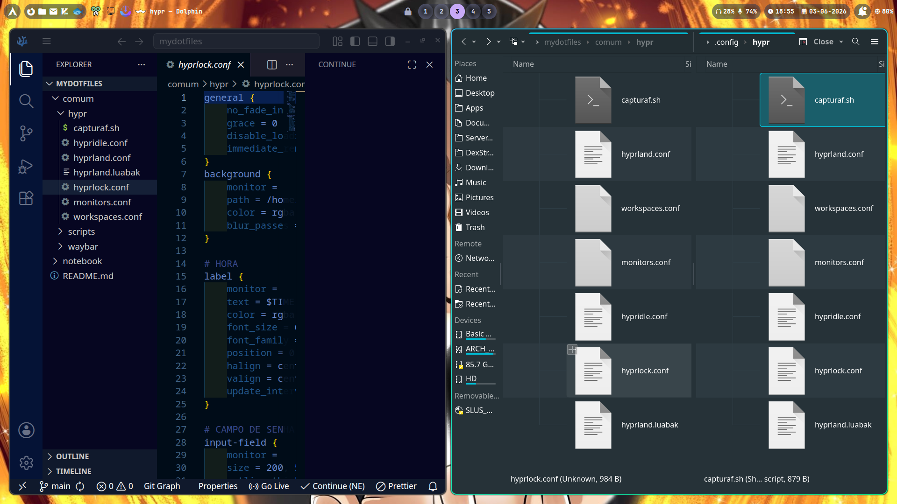

<div align="center">

# ❄️ Meus Dotfiles

Um repositório pessoal para manter meu ambiente de desenvolvimento e uso diário sincronizado e organizado.


<br>
<table>
  <tr>
    <td valign="top" width="50%">
      
      <p align="center">🖥️ Arch Linux (Desktop)</p>
    </td>
    <td valign="top" width="50%">
      
      <p align="center">🪟 Ambiente Secundário / Notebook</p>
    </td>
  </tr>
</table>

---
</div>

## 🛠️ O Setup

Essas são as engrenagens principais que fazem o sistema rodar:

* **Sistema Operacional:** [Arch Linux](https://archlinux.org/)
* **Window Manager:** [Hyprland (Wayland)](https://hypr.land/)
* **Barra de Status:** [Waybar](https://github.com/alexays/waybar)
* **Lockscreen:** [Hyprlock](https://wiki.hypr.land/Hypr-Ecosystem/hyprlock/)
* **Captura de Tela:** Grim + Slurp + Magick
* **Edição Rápida:** Satty

## 📂 Estrutura do Repositório

Como eu utilizo máquinas com propósitos e hardwares diferentes, dividi os arquivos para evitar conflitos. Tudo é copiado seletivamente para a pasta `~/.config/`.

```text
📦 meus-dotfiles
 ┣ 📂 comum/                 # Funciona perfeitamente em qualquer máquina
 ┃ ┗ 📂 scripts/             # Scripts de captura de tela, utilitários, etc.
 ┣ 📂 desktop/               # Configurações de alta performance e múltiplos monitores
 ┃ ┗ 📜 hyprland.conf        
 ┗ 📂 notebook/              # Configurações focadas em economia de bateria e rede móvel
   ┗ 📜 hyprland.conf
```
<br>

## 📦 A Megathread de Aplicativos (🚧EM CONSTRUÇÃO🚧)
**Índice Rápido:**
* [🖥️ Core System & Terminal](#core-system--terminal)
* [🛠️ Desenvolvimento & Engenharia](#desenvolvimento--engenharia)
* [🌐 Navegação, Comunicação & Downloads](#navegação-comunicação--downloads)
* [✍️ Escrita, Leitura & Produtividade](#escrita-leitura--produtividade)
* [🎬 Mídia & Entretenimento](#mídia--entretenimento)

---

Esta é a coletânea de ferramentas que utilizo no meu dia a dia no Arch Linux. A lista está dividida por categorias para facilitar a navegação.

### 🖥️ Core System & Terminal
| Categoria               | Ferramenta                                   | Por que uso?                                                                                                    |
| :------------------------| :---------------------------------------------| :----------------------------------------------------------------------------------------------------------------|
| Shell                   | [Zsh](https://www.zsh.org/)                  | *O bash é top, porém o zsh tem mais complementos como oh-my-zsh e o autocomplete é muito melhor*                |
| Terminal                | [Kitty](https://github.com/kovidgoyal/kitty) | *Leve, bonito e útil, minimalista mas poderoso*                                                                 |
| Gerenciador de Arquivos | [Dolphin](https://apps.kde.org/dolphin/)     | *Mesmo fora do ecosistema da KDE, é um dos melhores, porém se quiser outro recomendo thunar, pcmanfm, nemo etc* |

### 🛠️ Desenvolvimento & Engenharia
| Categoria        | Ferramenta                                   | Por que uso?                                                                                                                                                                               |
| :-----------------| :---------------------------------------------| :-------------------------------------------------------------------------------------------------------------------------------------------------------------------------------------------|
| Editor de Código | [VSCodium](https://vscodium.com/)            | *Vscode, porém código aberto, sem telemetria da microsoft (mais leve) e com suporte total as extensões do vscode normal,*                                                                  |
| Containers       | [Podman Desktop](https://podman-desktop.io/) | *O  docker-desktop é muito ruim, o podman além de ter sua engine propria, tem o podmandesktop que consegue gerir outras ferramentas incluindo o docker (bem  melhor que o docker-desktop)* |

### 🌐 Navegação, Comunicação & Downloads
| Categoria           | Ferramenta                                            | Por que uso?                                                                                                                                                                      |
| :--------------------| :------------------------------------------------------| :----------------------------------------------------------------------------------------------------------------------------------------------------------------------------------|
| Navegador Web       | [Floorp](https://floorp.app/)                         | *Gosto do firefox, porém uso floorp por ter "workspaces", que dividem o  fluxo de trabalho, estudo, pesquisa  etc, tem extensões pra isso eu acho, mas gostei do floorp*          |
| Central Social      | [Ferdium](https://ferdium.org/)                       | *Aqui consegue juntar whatsapp, discord, trello etc em um app só, é como se tivesse rodando o site, mas de forma organizada e mais intuitiva que simplesmente abrir no navegador* |
| Gestor de Downloads | [AB-Download Manager](https://abdownloadmanager.com/) | *Melhor que baixar  no navegador, leve, e se integra no navegador com uma extensao, então é só clicar  baixar no navegador que vai direto pro popup do AB-DM*                     |

### ✍️ Escrita, Leitura & Produtividade
| Categoria           | Ferramenta                                                                            | Por que uso?                                                                                                                                                                                                                               |
| :--------------------| :--------------------------------------------------------------------------------------| :-------------------------------------------------------------------------------------------------------------------------------------------------------------------------------------------------------------------------------------------|
| Escrita Criativa    | [novelWriter](https://novelwriter.io/)                                                | *Muito  completo e organizado, focado em escrita de livros e projetos complexos, nao para anotações simples etc*                                                                                                                           |
| Leitura & E-books   | [Calibre](https://calibre-ebook.com/)                                                 | *Faz tudo no que diz respeito a livros e documentos variados, lê, converte, edita metadados etc. Além de organização de biblioteca digital, o que torna possível configuração de bibliotecas remotas e compartilhadas entre  dispositivos* |
| Suíte de Escritório | [LibreOffice](https://www.libreoffice.org/) / [Google Docs](https://docs.google.com/) | *Libreoffice porque é código aberto e faz tudo, ou quase, que o da microsoft. Googledocs, por mais que não seja aberto, e provavelmente espione até a alma, é util pro dia a dia e colaboração simultânea*                                 |

### 🎬 Mídia & Entretenimento
| Categoria       | Ferramenta                       | Por que uso?                                                                                                                                                 |
| :----------------| :---------------------------------| :-------------------------------------------------------------------------------------------------------------------------------------------------------------|
| Player de Vídeo | [VLC](https://www.videolan.org/) | *Tem melhores pra cada uso, tem mais  leves, mais robustos etc, mas o VLC segue invicto abrindo tudo que preciso e rodando em todos os sistemas que conheço* |